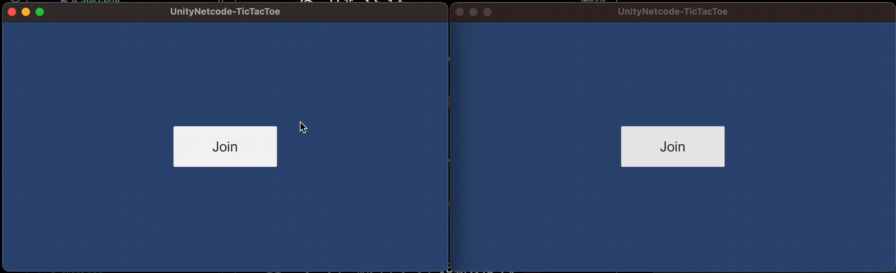
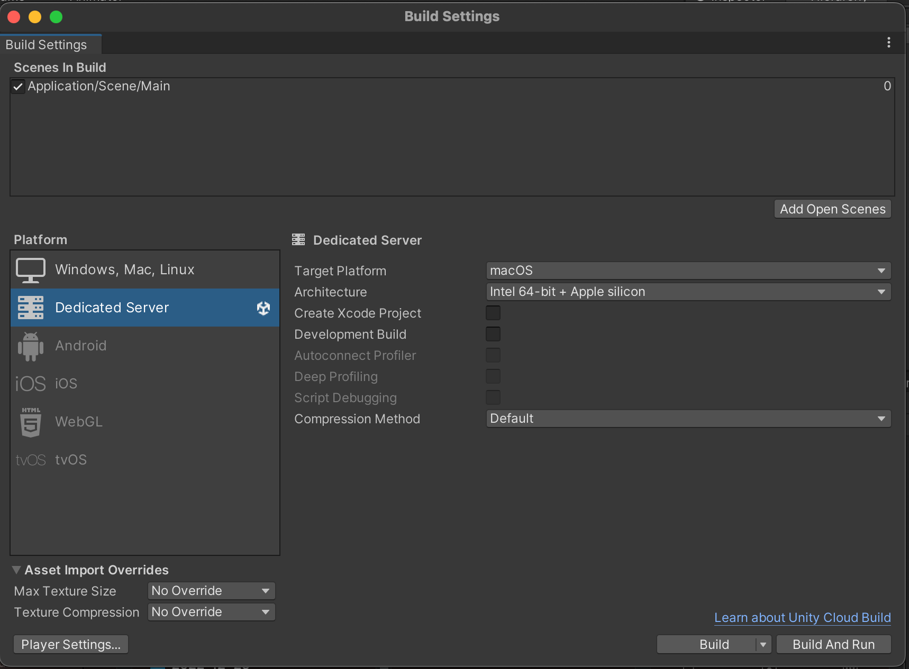
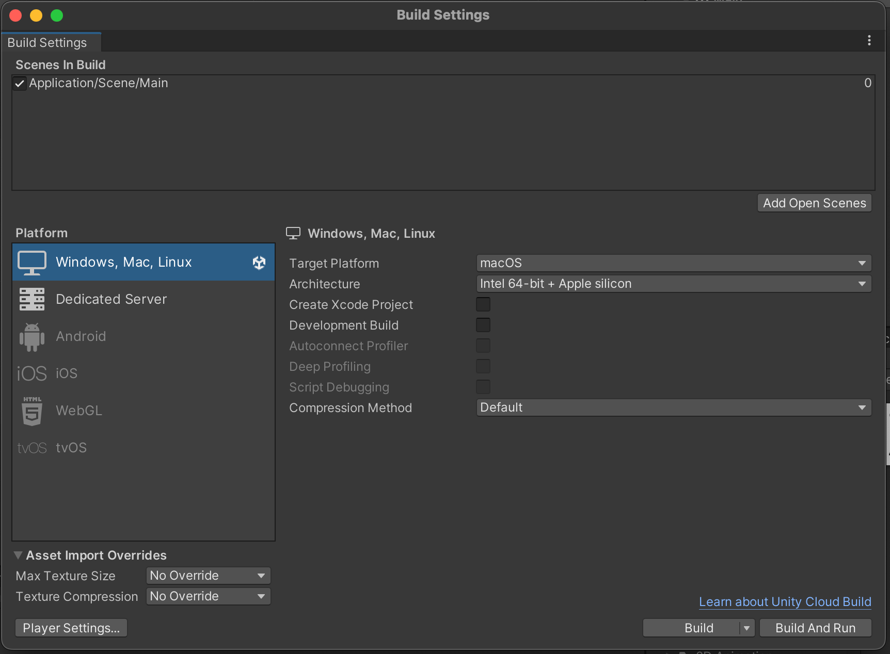
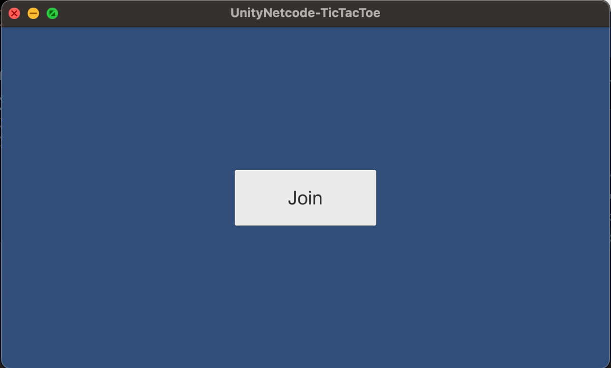
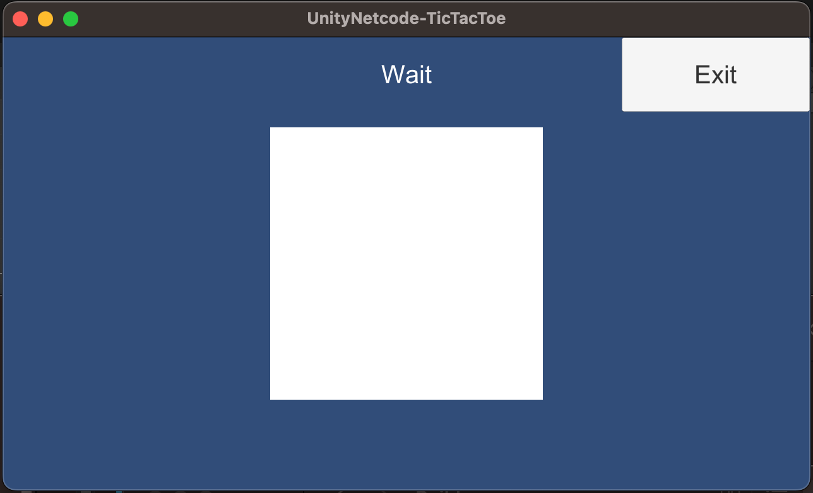
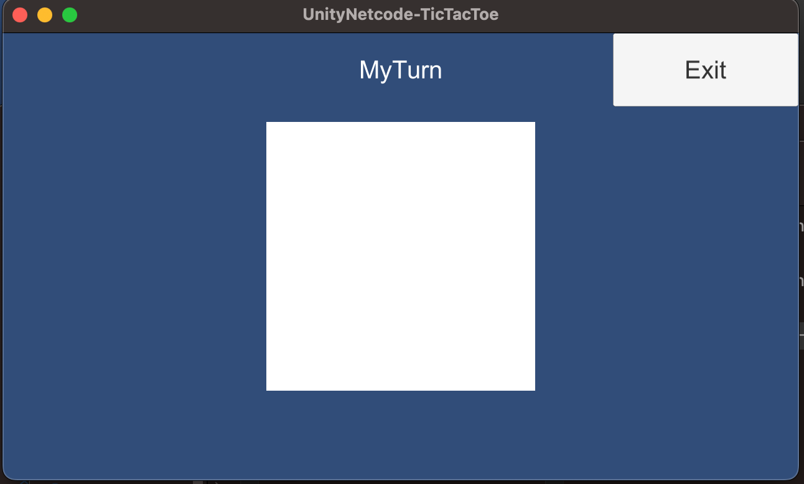
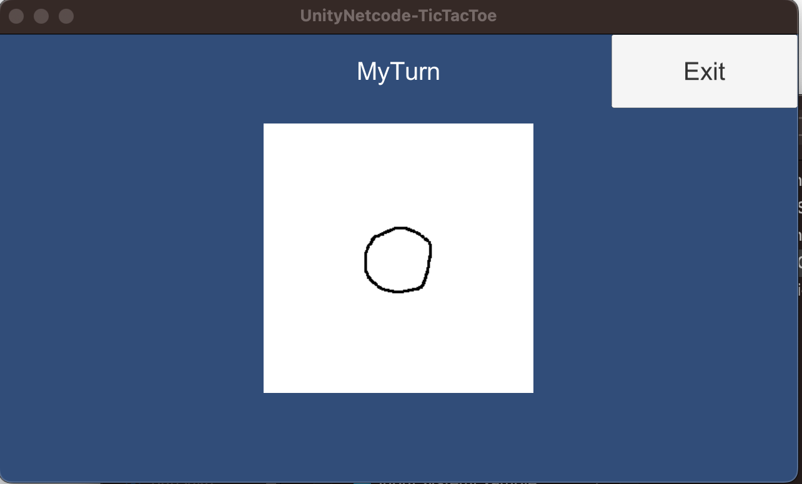

# UnityNetcode-TicTacToe
Netcodeによって実装された二人対戦可能な三目並べです。


# 動かし方
下記画像を参考にサーバー側のバイナリを用意します。


下記画像を参考にクライアント側のバイナリを用意します。


サーバー側バイナリを起動します。  
※`UN-TicTacToe-Server`としてビルドした場合
````.sh
./UN-TicTacToe-Server/UnityNetcode-TicTacToe
````

クライアント側のバイナリを複製して二つ起動するか、  
もう片方をUnityEditorから起動して二人のクライアントが存在する状態にします。  
起動直後は以下画像の様になっているはずです。


ジョインを押下すると以下の様になります。


もう一人プレイヤーが入ってくるとどちらかの画面が `MyTurn` になるはずです。  
※ちなみにどちらかが `Exit` を押下するともう片方もサーバーから抜けます。


`MyTurn`になっている方のプレイヤーはマウスクリックでマル/バツを置くことができます。  
置くともう片方のプレイヤーにも反映され、ターンが切り替わります。
